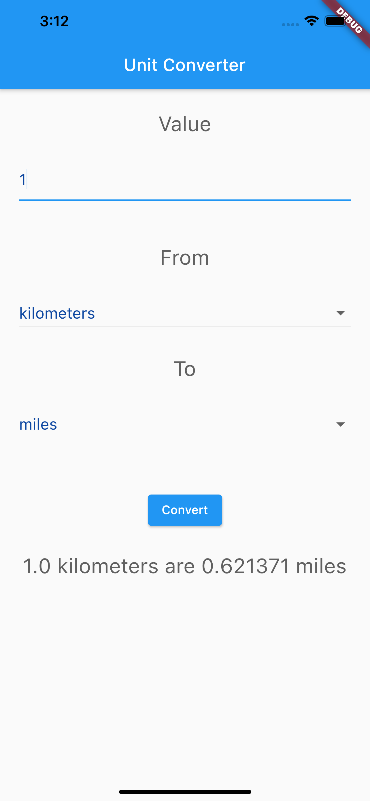

# unit_converter

A Unit Converter project.

## Getting Started

This project is to calculate unit conversions easily.

A few resources to get you started for Flutter project:

- [Lab: Write your first Flutter app](https://flutter.dev/docs/get-started/codelab)
- [Cookbook: Useful Flutter samples](https://flutter.dev/docs/cookbook)

